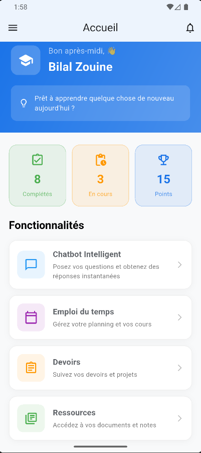
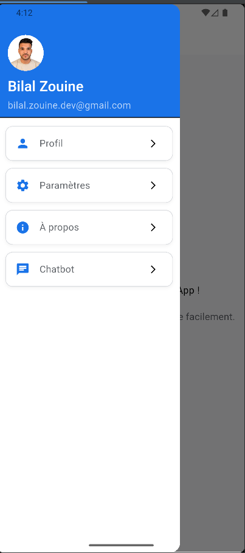
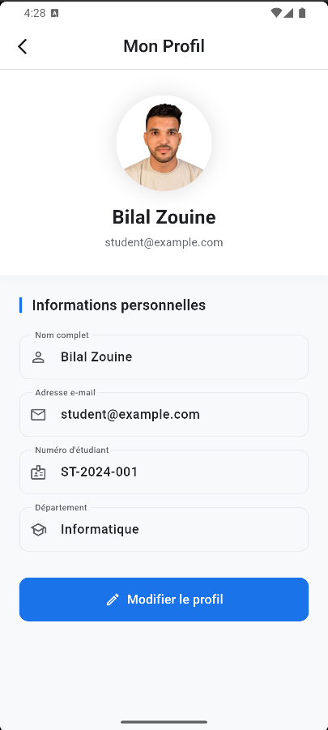
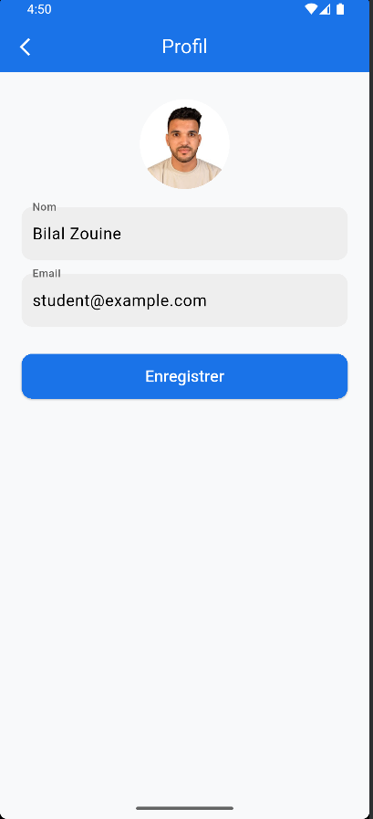
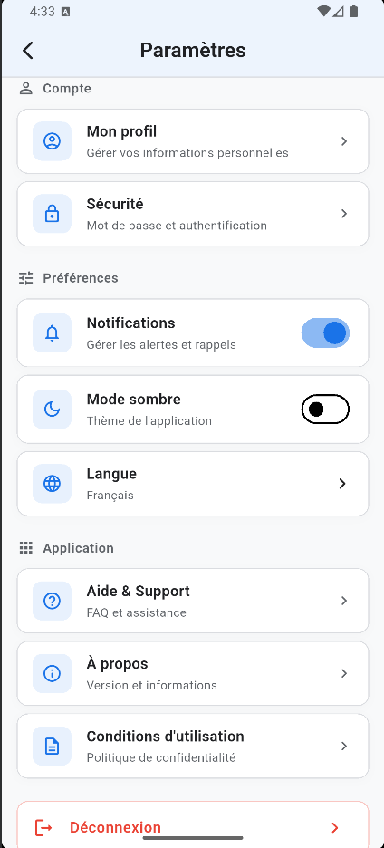

# 📱 Smart Student App

## Présentation générale

**Smart Student App** est une application mobile Flutter dédiée à la **gestion et à l’assistance des étudiants**. Elle propose une interface moderne, cohérente et professionnelle, reposant sur un **thème global centralisé**, une architecture claire et des composants réutilisables.

L’application a été conçue dans un contexte académique (examen/projet), en respectant les **bonnes pratiques Flutter**, le **Material Design 3** et une séparation nette des responsabilités (UI, logique métier, services, modèles).

---

## 🎯 Objectifs du projet

* Offrir une interface **moderne, lisible et professionnelle**
* Centraliser la gestion des **couleurs et du thème**
* Faciliter la **maintenance et l’évolutivité** du code
* Implémenter un **chatbot intelligent** connecté à une API backend
* Respecter une architecture claire et scalable

---

## 🗂️ Structure du projet

```bash
lib/
├── main.dart
├── models/
│   ├── chat_context.dart
│   ├── chat_context.g.dart
│   ├── chat_message.dart
│   ├── chat_response.dart
│   ├── chat_response.g.dart
│   └── settings_item.dart
│
├── pages/
│   ├── HomePage.dart
│   ├── ProfilePage.dart
│   ├── SettingsPage.dart
│   ├── AboutPage.dart
│   └── ChatbotPage.dart
│
├── services/
│   ├── chat_service.dart
│   └── chat_service.g.dart
│
├── theme/
│   ├── app_colors.dart
│   └── app_theme.dart
│
├── widgets/
│   ├── AppDrawer.dart
│   ├── DrawerItem.dart
│   ├── SettingsOption.dart
│   │
├── home/
│   │   ├── welcome_header.dart
│   │   ├── feature_card.dart
│   │   └── quick_stats.dart
│   ├── profile/
│   │   ├── ProfileAvatar.dart
│   │   ├── ProfileField.dart
│   │   └── ProfileButton.dart
│   │
│   ├── about/
│   │   ├── app_header.dart
│   │   ├── section_card.dart
│   │   ├── info_card.dart
│   │   └── about_footer.dart
│   │
│   └── chatbot/
│       ├── chat_bubble.dart
│       ├── chat_input.dart
│       └── typing_indicator.dart

assets/
├── images/
└── screenshots/
```

---

## 🎨 Thème global et système de couleurs

### 📌 AppColors (`app_colors.dart`)

Toutes les couleurs de l’application sont **centralisées** afin d’assurer une cohérence visuelle et une maintenance simplifiée.

Couleurs définies :

* **Primary** : couleur principale de la marque
* **Secondary** : accents et éléments interactifs
* **Background** : arrière-plan global
* **Surface** : cartes, AppBar, Drawer
* **TextPrimary** : texte principal
* **TextSecondary** : texte secondaire
* **Border** : séparateurs et bordures
* **Status colors** : succès, avertissement, erreur

---

### 🎭 AppTheme (`app_theme.dart`)

* Activation de **Material 3**
* `ColorScheme` personnalisé basé sur `AppColors`
* Typographie cohérente (Roboto)
* Styles unifiés pour :

  * AppBar
  * Drawer
  * Boutons
  * Cartes

Le thème global facilite l’ajout futur du **mode sombre** et les changements de branding.

---

## 🧭 Navigation & Drawer

### AppDrawer

Le **menu latéral** permet une navigation fluide entre les écrans principaux.

Fonctionnalités :

* Avatar utilisateur
* Nom et email
* Navigation vers :

  * Accueil
  * Profil
  * Paramètres
  * À propos
  * Chatbot

---

## 🏠 Page d'Accueil (`HomePage`)

### Description

La page d'accueil offre une **vue d'ensemble de l'application** avec un accès rapide aux principales fonctionnalités. Elle accueille l'étudiant avec un message personnalisé et présente les statistiques et actions disponibles.

### Fonctionnalités

* 👋 **Message de bienvenue dynamique** - Salutation basée sur l'heure de la journée
* 📊 **Statistiques rapides** - Aperçu des tâches complétées, en cours et points gagnés
* 🎯 **Actions rapides** - Accès direct aux fonctionnalités principales
* 🔔 **Notifications** - Bouton pour accéder aux notifications
* 🎨 **Design moderne** - Interface avec gradient et animations

### Widgets utilisés

* `WelcomeHeader` - En-tête avec gradient et informations utilisateur
* `QuickStats` - Cartes de statistiques
* `FeatureCard` - Cartes de fonctionnalités cliquables
* `AppDrawer` - Menu latéral de navigation

## 👤 Page Profil (`ProfilePage`)

### Description

Cette page permet à l’étudiant de **consulter et modifier ses informations personnelles**.

### Fonctionnalités

* Affichage de l’avatar
* Champs Nom et Email
* Bouton **Modifier / Enregistrer**
* Activation/désactivation des champs
* Confirmation via **SnackBar**

### Widgets utilisés

* `ProfileAvatar`
* `ProfileField`
* `ProfileButton`

---

## ⚙️ Page Paramètres (`SettingsPage`)

### Description

La page Paramètres regroupe différentes options configurables dans une interface claire et lisible.

### Fonctionnalités

* Mode sombre (statique)
* Notifications (statique)
* Autres options : Langue, Aide, etc.
* Liste scrollable avec cartes stylisées

### Widget réutilisable

* `SettingsOption` : icône + titre + trailing widget

---

## ℹ️ Page À propos (`AboutPage`)

### Vue d’ensemble

L’écran **À propos** présente les informations générales et techniques de l’application.

### Composants

* `AppHeader` : titre, icône, version
* `SectionCard` : description de l’application
* `InfoCard` : informations techniques
* `AboutFooter` : crédits développeur

---

## 🤖 Page Chatbot (`ChatbotPage`)

### Description

Le Chatbot permet à l’étudiant d’interagir avec une **API backend intelligente** via une interface de messagerie moderne.

### Fonctionnalités

* Envoi de messages utilisateur
* Réception de réponses IA
* Gestion du contexte (source, score, modalité)
* Indicateur de saisie
* Gestion des états : loading, erreur

---

### Architecture Chatbot

**Frontend (Flutter)**

* ChatbotPage
* ChatService
* Modèles sérialisés avec `json_serializable`

**Backend (API)**

* Route : `POST /chat`
* Port : `6000`
* Réponse : answer + context

---

### Exemple de requête API

```json
{
  "query": "Décris l'image"
}
```

### Exemple de réponse API

```json
{
  "response": "Un chat domestique tigré gris à poil court...",
  "context": [
    {
      "source": "data/images.jpg",
      "chunk": "Un chat domestique tigré gris...",
      "modality": "image",
      "score": 0.24
    }
  ]
}
```

---

## ⚙️ Génération des fichiers `.g.dart`

```bash
flutter pub run build_runner build --delete-conflicting-outputs
```

Fichiers générés automatiquement :

* `chat_response.g.dart`
* `chat_context.g.dart`
* `chat_service.g.dart`

---

## 🧠 Gestion des erreurs

* Message vide bloqué côté UI
* Timeout et erreurs réseau gérés
* Message d’erreur clair pour l’utilisateur

---

## 🖼️ Captures d’écran

Les captures illustrent :

* Page Accueil
* Drawer
* Profil (lecture / édition)
* Paramètres
* À propos
* Chatbot

---

## 🖼️ Captures d'écran

### Page d'Accueil


*Vue d'ensemble avec message de bienvenue, statistiques et actions rapides*

---

### Menu Latéral (Drawer)


*Navigation principale avec avatar et informations utilisateur*

---

### Page Profil
<div style="display: flex; gap: 10px;">
  
  
</div>

*Mode lecture et mode édition du profil*

---

### Page Paramètres


*Options de configuration de l'application*

---


## ✅ Conclusion

**Smart Student App** est une application Flutter complète, bien structurée et professionnelle, démontrant :

* Une bonne maîtrise de Flutter
* Une architecture claire
* Une UI moderne et cohérente
* Une intégration API avancée (chatbot)
