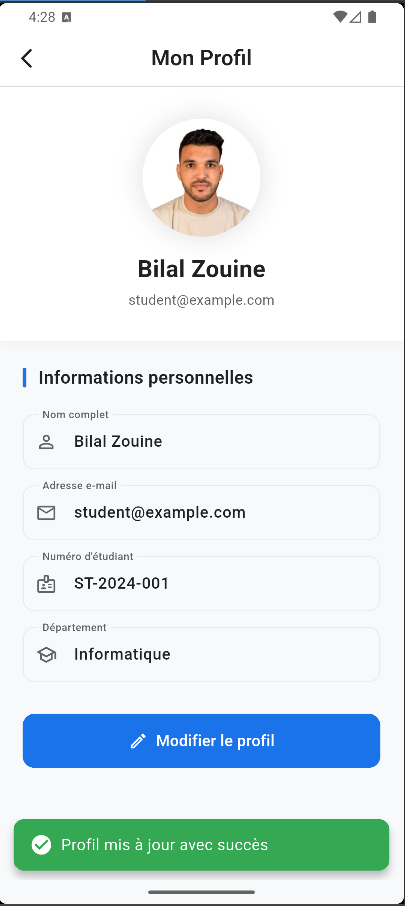

# 📱 Smart Student App

Application Flutter pour la gestion et l’assistance des étudiants avec une interface moderne et un thème centralisé.

# 🎨 App Theme & Color System

This module defines the **global color palette and theme configuration** for the `smart_student_app`.  
It follows **Google Material 3** principles to ensure consistency, accessibility, and a professional UI.

---

## 📁 Structure

lib/
├─ pages/
│ ├─ AboutUsPage.dart
│ ├─ ChatBootPage.dart
│ ├─ HomePage.dart
│ ├─ ProfilePage.dart
│ └─ SettingsPage.dart
├─ them/
│ ├─ app_colors.dart
│ └─ app_theme.dart
├─ widgets/
│ └─ AppDrawer.dart
└─ main.dart

assets/
├─ images/
└─ screenshots/

---

## 🎯 Design Goals

- Clean and professional appearance
- Inspired by Google Material Design
- Centralized color and theme management
- Easy scalability (dark mode, branding updates)
- Consistent typography and spacing

---

## 🎨 Color Palette (`AppColors`)

All colors are centralized in a single class for maintainability.

### Defined Colors

- **Primary**: Main brand color
- **Secondary**: Accent and highlights
- **Background**: App scaffold background
- **Surface**: Cards, AppBar, Drawer
- **TextPrimary**: Main text color
- **TextSecondary**: Secondary / muted text
- **Border**: Dividers and outlines
- **Status Colors**: Success, Warning, Error

---

🎭 Theme Configuration (appTheme)

The app uses Material 3 with a custom ColorScheme and typography.

Key Features

Material 3 enabled

Roboto font

Consistent AppBar and Drawer styling

Readable, accessible typography

---

## 🏠 Pages et Fonctionnalités

### 1. Page Accueil (`HomePage`)
- Interface principale avec contenu central.
- Affiche le contenu principal pour l'utilisateur.
- Accès au **Drawer Menu** pour navigation rapide.

### 2. Menu Latéral (Drawer) (`AppDrawer`)
- **Avatar** utilisateur avec nom et email.
- Navigation vers les pages :
  - Accueil
  - Profil (`ProfilePage`)
  - Paramètres (`SettingsPage`)
  - À propos (`AboutUsPage`)
  - Chatbot (`ChatBootPage`)

### 3. Page Profil (`ProfilePage`)

Cette page permet à l’étudiant de **visualiser et modifier ses informations personnelles** (nom, email, avatar) en utilisant le **thème global** de l’application.

---

## Fonctionnalités

- Affichage de l’**avatar** de l’étudiant.
- Affichage du **nom** et de l’**email**.
- **Bouton Modifier / Enregistrer** :
  - Initialement, les champs sont désactivés.
  - Cliquer sur **Modifier** active les champs.
  - Cliquer sur **Enregistrer** sauvegarde les informations et désactive les champs.
- Notifications via **SnackBar** après mise à jour.
- Design **moderne et épuré**, couleurs douces et uniformes.

---

## Structure du code

### Page principale
- `ProfilePage` : page principale en `StatefulWidget`.

### Sous‑widgets
- `ProfileAvatar` : affiche l’image de profil.  
- `ProfileField` : champ texte pour nom et email, stylisé avec bord arrondi et fond gris clair.  
- `ProfileButton` : bouton Modifier / Enregistrer, stylisé avec couleur primaire et bord arrondi.
.

### 4. Page Paramètres (`SettingsPage`)
- Configuration de l'application.
- Thèmes (clair / sombre), notifications, préférences utilisateur.

### 5. Page À propos (`AboutUsPage`)
- Informations sur l'application et l'équipe de développement.
- Version et contacts.

### 6. Page Chatbot (`ChatBootPage`)
- Interface de discussion avec le chatbot intégré.
- Aide et assistance pour l'utilisateur.

---

## 🎨 Thème Global
- Couleurs centralisées dans `app_colors.dart`.
- Thème global configuré dans `app_theme.dart`.
- Support Material 3 et typographie cohérente.
- Facilite le passage en **dark mode** et les mises à jour de branding.

---

## 🖼 Screenshots

### Page Accueil

### Drawer Menu

### Page Profil

### Page Paramètres

### Page À propos

### Page Chatbot

---

